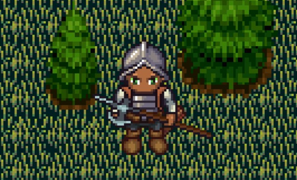

# **The Cursed Return**

## _Game Design Document Versión Final_

---

##### **© 2025 Infinite Horizon Studios. Todos los derechos reservados.**

**"The Cursed Return"** y todos los contenidos relacionados, incluyendo pero no limitado a: diseño del juego, personajes, historia, arte, música, código fuente y documentación, son propiedad intelectual de **Infinite Horizon Studios**.

Queda estrictamente prohibida la reproducción, distribución, modificación o uso no autorizado de cualquier parte de este documento o del juego sin el consentimiento previo por escrito de **Infinite Horizon Studios**.

**Autores**
- Valentina Castilla | A01028209
- Diego de la Vega Saishio | A01420632
- Luis Emilio Veledíaz | A01029829

**Profesores**
- Esteban Castillo Juarez
- Gilberto Echerría Furió
- Octavio Navarro Hinojosa
##
## _Index_

---

1. [Index](#index)
2. [Game Design](#game-design)
    1. [Logo](#logo)
    2. [Summary](#summary)
    3. [Gameplay](#gameplay)
    4. [Mindset](#mindset)
3. [Technical](#technical)
    1. [Screens](#screens)
    2. [Controls](#controls)
    3. [Mechanics](#mechanics)
4. [Level Design](#level-design)
    1. [Themes](#themes)
    2. [Game Flow](#game-flow)
5. [Development](#development)
    1. [Classes](#abstract-classes--components)
6. [Graphics](#graphics)
    1. [Style Attributes](#style-attributes)
    2. [Graphics Needed](#graphics-needed)
7. [Sounds/Music](#soundsmusic)
    1. [Style Attributes](#style-attributes-1)
    2. [Sounds Needed](#sounds-needed)
    3. [Music Needed](#music-needed)
8. [Schedule](#schedule)

## _Game Design_

---
### **Logo**

### **Summary**

Desarrollado por Infinite Horizon Studios, "The Cursed Return" es un roguelite top-down de acción, aventura y supervivencia, que contiene elementos de RPG´s, en el que eres un soldado atrapado en un loop temporal creado por una hechicera que busca venganza. La guerra entre los reinos del Norte y del Sur ha terminado, pero a un costo terrible. Tras años de lucha, estás listo para regresar a casa, pero algo no está bien: el mundo a tu alrededor comienza a cambiar de maneras extrañas.

Explora niveles aleatorios, lucha contra enemigos desafiantes y toma decisiones que definirán el destino de tu personaje. Al principio de la partida elige entre guerrero, arquero y hechicero, cada uno con armas únicas y especiales, pero recuerda que cada elección tiene un costo, ya sea bueno o malo. La maldición no solo te persigue, sino que también altera la realidad, creando peligros impredecibles y enemigos cada vez más poderosos.

La maldición es el elemento distintivo de nuestro juego. La barra se agota con cada segundo que pasa, si esta llega a cero el destino está sellado, morir y empezar de nuevo. La maldición no solo te limita, genera desafíos impredecibles por lo que es indispensable adaptar tu estrategia en cada partida.

### **Gameplay**

El objetivo del juego es completar diferentes niveles, mientras el jugador intenta llegar a jefe final y así romper su maldición mientras derrota a múltiples enemigos. En el juego, el jugador elige al inicio una de las siguientes clases: mago, arquero y guerrero. Mientras el jugador avanza por las salas, encontrará NPC´s que le ayudarán a avanzar más rápido, y obtendrá una aumento en su barra de maldición para que tenga más tiempo para llegar a la sala final. El juego recuerda mucho a un Role-Play Game debido a que el jugador asume el papel de un personaje y avanza a través de una historia, combates y exploración. En este caso el combate es en tiempo real, y el jugador tendrá que pensar estratégicamente en qué momento usar su arma secundaria (en caso de tenerla) y adaptarse a lo que el juego le tenga preparado.

### **Mindset**

Queremos hacer que el jugador se sienta como un héroe que siempre piensa qué hacer y las consecuencias de sus acciones, mientras se mantiene alerta de los riesgos que su personaje corre. Queremos provocar este mindset colocando al jugador en situaciones donde deberán decidir si utilizar sus ventajas, o guardarlas para otro momento.
También buscamos que los jugadores se sientan como aventureros mientras avanzan por los niveles en búsqueda de una manera de romper la maldición. Los diferentes entornos provocarán un sentido de aventura para el jugador, ya que explorarán zonas que siempre serán completamente diferentes.
Finalmente, queremos provocar una sensación de precaución, con la que el jugador deberá decidir de manera estratégica las acciones que realizará, para llegar lo más lejos posible antes de que la maldición lo elimine. Además deberán elegir su clase considerando los posibles peligros que se presentarán en cada nivel.

## _Technical_

---

### **Screens**

El juego contará con varias pantallas clave, cada una diseñada con una interfaz clara y funcional para mejorar la experiencia del usuario. Cada pantalla tendrá su propio propósito y navegación bien definida. A continuación se explican las pantallas más importantes, además, se mostrará el concepto inicial, junto con el final.

1. **Title Screen (Pantalla de Inicio)**

    Propósito: Servir como la primera impresión del juego y ofrecer acceso a las opciones principales de navegación y configuración. Se incluirá:

- *Logo del juego**: Posicionado en el centro superior de la pantalla, acompañado de una animación que lo hará destacar visualmente.
- *Botón de "Nueva Partida"*: Permite iniciar una nueva aventura desde el principio.
- *Botón de "Cargar Partida"*: Disponible sólo si existe un progreso guardado previamente.
- *Menú de Opciones*: Acceso a configuraciones avanzadas de sonido y controles.
- *Sección de Créditos*: Un apartado para reconocer al equipo de desarrollo y colaboradores.
- *Animaciones en el fondo*: Se integrarán efectos visuales.
- *Música de fond*o: Un tema de introducción envolvente que refuerce la atmósfera del juego.
- *Botón de "Salir"*: Opción para cerrar el juego de manera inmediata.

A continuación se muestra un boceto de cómo se vería:

A continuación se muestra una imagen de cómo quedó la version final:
- agregar imagen

2. **Menú de Opciones**

    Propósito: Permitir mdificar configuraciones del juego para adaptarlo a las preferencias del jugador. Se incluirá:

- *Volumen de Efectos*: Ajuste específico para los sonidos del combate y ambiente.
- *Volumen de música*: Permite ajustar el nivel de volumen de la banda sonora.
- *Botón de "Regresar"*: Para volver al menú principal.

A continuación se muestra una imagen de cómo quedó la version final:
- agregar imagen

3. **Juego Principal**

    Propósito: Es la pantalla donde ocurre la jugabilidad, con la interfaz del usuario (UI) mostrando información relevante. Se incluirá:

- *Área central del juego*: Representa el mundo en el que el jugador se moverá e interactuará con personajes y enemigos.
- *Barra de salud*: Indica la vida restante del personaje.
- *Barra de maldición*: Representa el tiempo disponible antes de que la maldición afecte al jugador.
- *Iconos de estado*: Notificaciones visuales que informan sobre mejoras temporales o penalizaciones activas.
- *Menú de pausa*: Permite acceder a configuraciones, controles y otras opciones sin salir del juego.

A continuación se muestra una imagen de cómo quedó la version final:
- agregar imagen

A continuación se muestra una secuencia de los sprites finales para nuestros personajes:

*Las tres clases para nuestro juego, Mago, Arquero y Soldado. En ese orden*

Al inicio se tenían en cuenta otros sprites, pero esos sprites limitaban el movimiento que queríamos implementar, por lo que optamos por rediseñar nuestros sprites para facilitarnos el proceso de animación.

*Sprites originales (no íbamos a usar todos)*

*Imagen de cómo se ven los personajes respecto a un pedazo del mapa*

- actualizar imagen

*Imagen de como se ve un personaje en relación a un nivel, con su heads-up display que muestra la barra de maldición (ícono del cráneo), la barra de vida (ícono del corazón) y una item box para las armas secundarias.*

4. **Créditos del juego**  

    Propósito: Mostrar el equipo de desarrollo y agradecer a los jugadores. Se incluirá:

- Nombres del equipo.
- Música de fondo.
- Opción para regresar al menú principal.
- Acreditaciones de elementos externos.

A continuación se muestra una imagen de cómo quedó la version final:
- agregar imagen

### **Controls**
El sistema de controles define cómo el jugador va a interactuar con el juego, permitiendo movimientos, ataques y acciones esenciales para la jugabilidad. A continuación se enlistan los controles para “The Cursed Return”.

1. **Movimiento del jugador**  

- W → Moverse hacia arriba.
- S → Moverse hacia abajo.
- A → Moverse hacia la izquierda.
- D → Moverse hacia la derecha.
- Barra de Espacio → Dash
 
2. **Ataques y Combate**  
- Ataque principal: K → Ataque con el arma equipada.
- Diferentes armas tienen diferentes animaciones y efectos.
- Si se deja presionada la tecla/click, se quedara el ataque en loop, en caso de utilizar las clases de arquero o mago, la animación quedará en un loop **sin disparar proyectiles**.

3. **Interacciones**  
- *Interacción*: Se utiliza la misma tecla porque tiene una función de interacción en circunstancias específicas.
- *Interacción con Curandero, Armero y con Cofres*: Tecla F → Permitirá interactuar con los personajes que le proporcionarán ayuda al jugador, al igual que podrán abrir cofres que encuentren a lo largo de su run.

4. **Navegación por el menú**  
    i. El jugador puede acceder al menú (sonido, estadísticas, guardar y salir, regresar) usando una tecla dedicada (esc).  
    ii. Se navegará por los menús utilizando el mouse.

### **Mechanics**  
Nuestro juego introduce una mecánica en específico que consideramos muy innovadora, que refuerza la temática de la maldición y el loop temporal. Pero algunas de las principales mecánicas son:  

1. **Barra de maldición**  
- La barra de maldición representa el tiempo que el jugador tiene para pasar las salas antes de ser víctima de la maldición y reiniciar su partida.
- Esta barra se agota de forma constante a lo largo del tiempo, y no puede regenerarse.
- La barra de maldición comienza llena y se vacía completamente en cierto tiempo si no se regenera.
- Derrotar jefes al final de cada nivel te otorga un aumento a la barra de maldición que permanece para el resto de runs de ese jugador.
- Su implementación está basada en un temporizador en segundo plano.

    **Ejemplo en el Gameplay**
    
    El jugador inicia con su barra de maldición llena y debe moverse rápidamente para empezar a derrotar enemigos, si tarda demasiado en el combate, el jugador morirá y reiniciará su partida. Si derrota a un jefe final en el nivel 1, su barra se extenderá y regenerará parte de su barra, permitiéndole seguir avanzando. 

    La siguiente tabla ilustra el tiempo total de la barra al inicio del juego (sin aumentos):
    
    | Minutos | Segundos | Tiempo total |
    |---------|----------|--------------|
    | 10      | 600      | 10:00        |

    Las siguientes imágenes ilustran el progreso de cómo es que la barra de maldición va bajando con el tiempo. En la imagen, diferenciamos la barra de vida de la barra de maldición por el ícono de cada barra, la barra de maldición tiene un ícono de un cráneo, y la barra de vida tiene un ícono de corazón. 

A continuación se muestra una imagen de cómo quedó la version final:
- agregar imagen

2. **Generación aleatoria de niveles**

- Cada partida será diferente gracias a la generación aleatoria de mapas.
- Los niveles del juego están compuestos por habitaciones conectadas, generadas de manera aleatoria a partir de un conjunto de salas predefinidas.
- Cada nivel tiene un ecosistema temático (desierto, bosque o nieve) y contiene enemigos, cofres y elementos únicos.
- Existen 12 salas en total, divididas en 4 por ecosistema.
- Cada partida selecciona aleatoriamente salas de cualquier ecosistema para construir el nivel.
- Las salas se bloquean hasta que el jugador elimine a todos los enemigos dentro.
- El jefe del nivel siempre estará al final y será el último desafío antes de avanzar al siguiente nivel.
- Cofres y recompensas aparecen en una sala aleatoria con enemigos.
- Al iniciar la partida, el jugador tiene tres formas de seguir: ganar derrotando a todos los enemigos, perder si su barra de vida llega a cero, ser eliminado por la maldición si su barra llega a cero.
- Cabe resaltar que al final de las doce salas, existe un jefe final, que tiene permitido a nivel de backend utilizar una sala repetida.

    **Ejemplo en el Gameplay**
    
    El jugador entra a la sala de un nivel, observa que hay enemigos de diferentes apariencias. Decide primero atacar a los enemigos de que poseen menos armadura, derrota a todos los enemigos y desbloquea la siguiente sala. El jugador continúa así hasta llegar a la sala del jefe.
 

3. **Progresión de las clases con ayuda de los NPC´s y la mejora de la maldición**

- El jugador podrá encontrarse con diferentes NPC´s que le permitirán mejorar su desempeño durante la partida.
- Existe un arma secundaria temporal, que se obtiene durante la partida y tiene una duración de 1 minuto.
- Existe un aumento del tamaño de la barra de maldición, que se obtiene al derrotar a un jefe y se mantiene por el resto de partidas.
 
4. **Combate rápido y estratégico**
-   El combate es en tiempo real, con una mecánica de “dash” que permite a los jugadores esquivar ataques y adaptarse a diferentes tipos y grupos de enemigos.
-   El jugador puede realizar una evasión rápida en cualquier dirección para  evitar ataques enemigos.
-   Cada clase comienza con un ataque básico predefinido.
-   Al obtener un arma secundaria, el ataque utiliza el arma secundaria, que también es más fuerte.
-   No existen efectos de estado como quemaduras o veneno, centrándose en el combate directo.

Cada clase tiene un estilo de combate único:
- El guerrero tiene ataques cuerpo a cuerpo con gran daño.
- El arquero tiene disparos a distancia con la mecánica de cargar el tiro para causar más daño.
- El mago tiene la habilidad de lanzar hechizos desde lejos.

A continuación se presenta una tabla ilustrativa de las diferencias de estadísticas entre las clases:

| Clase      | Guerrero | Arquero | Hechicero |
|------------|----------|---------|-----------|
| **Arma**   | Espada   | Arco    | Báculo/Bola de Fuego |
| **Ataque Básico** | 35       | 15      | 20        |
| **Ataque Cargado** | 60       | 40      | 50        |
| **Distancia** | Cuerpo a cuerpo | 40      | 20        |

Se utilizará un sistema de detección de colisiones y físicas para hacer que los ataques sean precisos y satisfactorios. Además de la generación aleatoria de niveles, la cantidad de enemigos será aleatoria, sin embargo hay unas restricciones por bioma:

- Los esqueletos solo aparecerán en el desierto.
- Los duendes y lagartos sólo aparecerán en el bosque.

A continuación se muestra una tabla con las vidas de los enemigos.

| Nivel    | Enemigo Común | Enemigo Fuerte | Jefes |
|----------|---------------|----------------|-------|
| **Nivel 1** | 70            | 200            | 1000  |
| **Nivel 2** | 100           | 350            | 1500  |
| **Nivel 3** | 150           | 500            | 2000  |

Aquí se asumirá que:
- Los esqueletos con poca armadura serán comunes.
- Los esqueletos con mayor armadura serán fuertes.
- Los duendes con poca armadura serán comunes.
- Los duendes con mayor armadura serán fuertes.
- Los lagartos con poca armadura serán comunes.
- Los lagartos con mayor armadura serán fuertes.

*Nota: se hablará de los personajes más a fondo en las siguientes secciones.

5. **Curandero, Armero y Cofres**

A lo largo del run del jugador, este podrá encontrarse con salas que contengan uno de los siguientes:
- Armero: le dará al jugador un arma secundaria aleatoria.
- Curandero: le regenerará al jugador una cantidad de HP predefinida.
- Cofre: le dará al jugador un arma secundaria aleatoria.

Estos elementos servirán como ventajas para el jugador ya que, el arma secundaria podrá causar más daño que el arma base de cada clase. Habrá 4 armas secundarias diferentes:

- Hacha de guerra: Un hacha que provocará gran daño, pero reduce la velocidad del jugador.
A continuación se muestra una imagen de cómo quedó la version final:
- agregar imagen

  
- Lanza: Una lanza que tendrá mucho daño, pero tendrá un corto alcance.
A continuación se muestra una imagen de cómo quedó la version final:
- agregar imagen

- Ballesta: Una ballesta que tendrá el daño de un arco cargado, pero un rango menor.
A continuación se muestra una imagen de cómo quedó la version final:
- agregar imagen

- Daga: Una daga que permitirá que las clases de rango lejano puedan acercarse a combate cuerpo a cuerpo.
A continuación se muestra una imagen de cómo quedó la version final:
- agregar imagen

En cuanto al armero, este podrá aparecer en una sala aleatoria con enemigos, en el momento en el que el jugador interactúe con él, se asignará un arma temporal aleatoria al jugador.

En cuanto a la curandera, también aparecerá en una sala aleatoria con enemigos, en el momento en el que el jugador interactúe con ella, se le asignará una regeneración de HP al jugador, la cuál le regenerará vida, más no maldición.

A continuación se muestran las imágenes finales de la Curandera y del Armero:

*Imagen final de la Curandera*

*Imagen final del Armero*

*Imagen final de cómo se verán los cofres abiertos y cerrados respectivamente* 

6. **Armas secundarias**

Como se mencionó previamente, a lo largo del run, el jugador encontrará armas secundarias que le darán una ventaja por cierto tiempo.
Previamente ya mencionado, habrá 4 armas secundarias diferentes: 
- Hacha de guerra
- Lanza
- Ballesta
- Daga

Estas armas se activarán en el momento en el que el jugador la recoja, con una duración de 1 minuto y al terminar ese tiempo, el jugador regresará al arma que le corresponde a la clase que eligió. Esto permitirá que el jugador pueda crear nuevas maneras para pasar niveles y derrotar a enemigos, pero también lo obligará a que piense de manera más crítica.

Si el jugador ya cuenta con un arma secundaria temporal, y encuentra a otros npc o cofre que le dé otra arma secundaria temporal, el jugador deberá considerar su estrategia para lo que le queda del run y escoger el arma con la cual continuar su camino (es decir, si tomar el arma o no).

A continuación se muestra una tabla que contiene información sobre cada arma secundaria:

| Arma           | Daño Básico | Distancia       |
|----------------|-------------|-----------------|
| **Ballesta**   | 40          | 30              |
| **Hacha de guerra** | 45     | Cuerpo a cuerpo |
| **Lanza**      | 40          | 10              |
| **Daga**       | Mismo que la clase | Cuerpo a cuerpo |

7. **Puntuación**

Con la finalidad de mostrar estadísticas que inciten al jugador a continuar haciendo runs, implementaremos un sistema de puntuación, a cada enemigo
se le asignará determinada puntuación.

En el momento en el que acabe el run del jugador, ya sea porque murió por daño, murió por la maldición o terminó el juego, se desplegará una pantalla de estadísticas del run en general, donde se mostrarán estadísticas como:

- Enemigos derrotados en el run
- Jefes derrotados en el run
- Con qué clase se jugó
- Cuánto duró el run
- Puntuación del run

La puntuación se asignará de la siguiente manera:

- Enemigo común: 1 punto
- Enemigo fuerte: 3 puntos
- Jefe: 10 puntos

Para fomentar la rejugabilidad y la competencia entre jugadores, se añadirá un sistema de records personales donde el jugador podrá ver sus mejores runs en distintas categorías:

- Run más largo (en tiempo).
- Mayor cantidad de enemigos derrotados en un solo run.
- Mayor puntuación obtenida en un run. 

---

## _Level Design_

---

### **Themes**

1. Desierto
    1. Atmósfera
        1. Incómoda, calurosa, árida
        2. Se ambienta en una aldea olvidada con ruinas antiguas y restos de civilizaciones.
    2. Objetos
        1. _Ambientales_
            1. Cactus
            2. Ruinas cubiertas por arena
            3. Esqueletos y restos de armadura
        2. _Interactivo_
            1. Esqueletos (enemigo - 2 variaciones)
            2. Esqueleto (jefe - 1 variación)
            3. Cofres
            4. Armas Secundarias
            5. Curandero
            6. Armero

Imagen final de un nivel del desierto:

2. Bosque
    1. Atmósfera
        1. Misteriosa, Oscura, Tranquila
    2. Objetos
        1. _Ambiente_
            1. Árboles grandes y matorrales densos
            2. Raíces
            3. Troncos caídos
        2. _Interactivo_
            1. Duendes (enemigo - 2 variaciones)
            2. Lobos (jefe - 1 variación)
            3. Cofres
            4. Armas Secundarias
            5. Curandero
            6. Armero

Imagen final de un nivel del bosque:

2. Nieve
    1. Atmósfera
        1. Fría, Hostil, Invernal
    2. Objetos
        1. _Ambiente_
            1. Paisaje cubierto de nieve
            2. Nieve cubriendo el suelo, sin afectar la movilidad del jugador.
            3. Rocas congeladas
            4. Piedras de hielo
        2. _Interactivo_
            1. Lagartos (enemigo - 2 variaciones)
            2. Minotauro (jefe - 1 variaciones)
            3. Cofres
            4. Armas Secundarias
            5. Curandero
            6. Armero

Imagen final de un nivel de la nieve:

### **Game Flow**

*Inicio del juego*
1. Aparece una breve secuencia de impagenes que dan contexto a la historia del juego.
2. El jugador comienza en un bioma aleatorio (bosque, desierto o nieve).
3. HUD aparece: barra de vida, barra de maldición.

*Exploración inicial*
1. El jugador se encuentra en la primera sala con una imagen que indica los controles del juego.
2. El jugador avanza a la segunda sala y trata de esquivar a todos los enemigos
3. El jugador se da cuenta que la puerta a la siguiente sala está cerrada.
4. El jugador observa el tipo de enemigos (fuertes o débiles) y toma decisiones sobre cómo proceder.
5. El jugador observa que la barra de maldición está comenzando a bajar.
6. La batalla comienza, el jugador comienza a atacar estratégicamente.

*Movimiento entre Salas*
1. Una vez derrotados los enemigos, la puerta o entrada a la siguiente sala se desbloquea.
2. El jugador se mueve hacia la siguiente sala aleatoria (bioma aleatorio), encontrando cofres y enemigos en cada una.
3. Las mecánicas como esquivar y ataques básicos se emplean constantemente durante el avance.

*Encuentro con el Jefe*
1. El jugador lleva a la cuarta sala, donde se encontrará a un Jefe.
2. La barra de maldición está a la mitad o menos, lo que genera presión adicional para completar el nivel.
3. Comienza el combate.

*Fase del Combate contra los Jefes*
1. El jugador se enfrenta al jefe final en una batalla emocionante.
2. El jefe tiene mecánicas especiales, como fuerza mucho mayor o con mucha más HP,  el jugador debe adaptarse a su patrón de ataque para sobrevivir.
3. El combate sucede bajo la presión de la maldición, con el jugador viendo cómo la barra disminuye constantemente.

*Finalización del nivel*
1. Si el jugador derrota al jefe, se aumenta el tamaño y capacidad máxima de la barra de maldición, además, se desbloquea la puerta para avanzar al siguiente nivel.
2. Si el jugador pierde debido a la barra de maldición vacía o morir, se muestra una pantalla de derrota y el jugador es regresado al inicio del nivel.

*Reiniciar o Continuar*
1. Al reiniciar, el jugador comienza de nuevo, pero con una nueva generación de niveles.
2. Además, el jugador conserva el tamaño alcanzado de la barra (en dado caso de que haya eliminado a un jefe en cierto nivel).

*Combate con el Jefe Final*
1. Si el jugador completa las 12 salas, llegará a una sala final, donde se encuentra el jefe final, el jugador deberá analizar los ataques del jefe y proceder como considere mejor, en caso de derrotarlo, el jugador será llevado a una pantalla de victoria.

A continuación, mostraremos unas tablas que simulan los valores de enemigos y tiempo en cada nivel (estos valores están sujetos a cambios de ser necesario y se usaron para visualizar el tiempo de sobra que le quedaría al usuario si se dedicara únicamente a eliminar enemigos):

**Nivel 1** 

Parte a): 

- En esta tabla se estima un tiempo que toma en eliminar a los enemigos por su fuerza para el primer nivel.
- Posteriormente, se pone el número de enemigos máximo del nivel (este es el mismo en todos los niveles).
- Después se obtiene el tiempo total que toma eliminarlos.

Parte b)

- Tiempo base por eliminación: Posteriormente, se calcula el tiempo base que se va a recuperar por eliminación de cada enemigo (un 30% del tiempo que toma eliminarlo)
- Tiempo extra porcentaje: En esta parte se calcula un umbral (aleatorio) de recuperación extra de energía, que va desde el 0.1%-0.3% del valor inicial de la barra al iniciar el nivel (en este caso, de 600 segundos).
- Es importante mencionar que se estimó con el mejor caso (0.3%) y el peor caso (0.1%) para ver ambos escenarios.

Parte c) y d)
- Tiempo agotado: Aquí se calcula el tiempo que se perdió en el mejor y el peor caso (restando el tiempo recuperado)
- Tiempo restante total: Aquí se calcula el tiempo restante (tiempo inicial-tiempo perdido) al terminar el nivel, con los dos escenarios.
- Tiempo restante promedio: Se calcula un promedio de ambos escenarios, para utilizarlo como referencia en el calculo del siguiente nivel.

**Nivel 2** 

En esta sección se hace el mismo proceso partiendo de 533.7 segundos, lo único que cambia es:
- El tiempo de eliminación de los enemigos aumenta, debido a que se vuelven más fuertes.
- El tiempo base de recuperación pasa de 30% a 20%
- El tiempo restante final (promedio) de recuperación es de 361 segundos.

**Nivel 3**

Los cambios son:
- El tiempo de eliminación de los enemigos.
- El tiempo base de recuperación pasa de 20% a 10%.
- El tiempo restante estimado al terminar el juego sería de 80 segundos.

## _Development_

---

El desarrollo del juego se estructuró en una serie de clases base y clases derivadas que encapsulan las mecánicas principales del juego.

### **Abstract Classes / Components**

Estos scripts contienen la lógica y propiedades fundamentales del juego:

---

- **player.js**  
  Gestiona movimiento, ataques (melee y a distancia), ataque cargado, dashes, animaciones, muerte del jugador.

- **enemy.js**  
  Controla el comportamiento de los enemigos (seguimiento al jugador, ataque, muerte, animaciones, daño recibido).

- **healer.js**  
  Define el comportamiento de la curandera NPC, permite curar al jugador al interactuar.

- **gunsmith.js**  
  Controla al armero NPC, permite entregar armas secundarias al jugador.

- **chest.js**  
  Maneja la lógica del cofre, entrega armas secundarias o pociones al abrirse.

- **secondaryWeapon.js** (si aplica, o integrado en `game_classes.js`)  
  Gestiona las armas secundarias (hacha, lanza, ballesta, daga), su daño, velocidad, alcance y duración.

- **map_manager.js**  
  Administra mapas, lectura de colisiones desde matriz, generación de salas, validación de posiciones libres.

- **curse.js**  
  Controla la barra de maldición (temporizador de tiempo límite), extensión al derrotar jefes.

- **tcr.js**  
  Dibuja la interfaz gráfica del juego: barra de vida, barra de maldición, íconos de clase y arma, puntaje, menú de pausa.

- **game.js**  
  Orquesta la lógica central del juego: control de niveles, habitaciones, spawns, enemigos, bosses, progreso y condiciones de victoria o derrota.

- **game_classes.js**  
  Contiene clases auxiliares como proyectiles (flechas, bolas de fuego, hechizos), armas secundarias, orbes mágicos, y animaciones personalizadas.

---

### **Personajes Jugables**

- Caballero → `player.js`  
- Arquero → `player.js`  
- Hechicero → `player.js`

---

### **Enemigos**

- Goblin → `enemy.js`  
- Esqueleto → `enemy.js`  
- Lagarto → `enemy.js`  
- Minotauro (jefe) → `enemy.js`  
- Lobo (jefe) → `enemy.js`  
- Bruja (jefa final) → `enemy.js` y `game_classes.js` (proyectiles mágicos)

---

### **NPCs**

- Curandera → `healer.js`  
- Armero → `gunsmith.js`  
- Cofre → `chest.js`

---

### **Obstáculos y Mapas**

- Paredes y colisiones → `map_manager.js`  
- Puertas que bloquean salida hasta limpiar enemigos → `game.js`

---

### **UI (Interfaz de Usuario)**

- Barra de maldición → `curse.js`  
- Barra de vida → `tcr.js`  
- Íconos de clase y arma → `tcr.js`  
- Puntaje de enemigos eliminados → `tcr.js`  
- Botón de menú / pausa → `tcr.js`

---

## _Graphics_

---

### **Style Attributes**

El juego utiliza una paleta de colores variada pero que al final del día permite diferenciar biomas y personajes sin dejar de tener sentido en cuanto a lo visual. A pesar de que no seguiremos una paleta de colores limitada, los tonos terrosos, fríos, o cálidos se emplean según el entorno para mantener una ambientación correcta y cómoda. 

Los colores presentan sombreados y contrastes que aportan profundidad pero mantienen un estilo pixel art característico. No aplicaremos un post-procesado HSV, pero los escenarios estarán diseñados para ser reconocibles sin necesidad de aplicar filtros o correcciones adicionales.

Algunos colores que utilizaremos son los siguientes:
- Para el soldado: #726b7e y #867e7f
- Para el arquero: #64a42c y #0b5c2f
- Para el hechicero: #3c49ad y #322d6a
- Para el bioma del bosque: #a0b12a y #4d8051
- Para el bioma del desierto: #d7bd4e y #ba8b4a
- Para el bioma de nieve: #a6b5b5 y #8cadb4

El estilo gráfico es en pixel art en 2D, con una resolución aproximada de 64x64 píxeles por personaje. Queremos que las armas y vestimentas tengan un toque semi-realista. Para los personajes vamos a utilizar contornos negros además de contrastes de color para definir las siluetas y sombras. 

Para tener una retroalimentación visual efectiva, incorporaremos diferentes efectos, por ejemplo, cuando el jugador o un enemigo recibe daño, se mostrará un flash rojo en la pantalla. Los enemigos también mostrarán un una barra de vida sobre ellos, que irá bajando conforme el daño que reciban. 

Los cofres y armas secundarias contarán con sus propios efectos y animaciones, también se implementarán animaciones en la barra de vida y maldición, al igual que colocar íconos por si el jugador obtiene el arma secundaria.

### **Graphics Needed**

**Personajes**

**1. Humanos (jugador)**
1. *Arquero*: No tendrá variación, y solo cambiará de arma en caso de encontrar un arma secundaria temporal.
   - Idle (cuatro direcciones)
   - Caminar (cuatro direcciones)
   - Atacar con arma principal (cuatro direcciones)
   - Atacar con arma secundaria (cuatro direcciones)
   - Dash (cuatro direcciones)
   - Recibir daño (cuatro direcciones)
   - Morir (una dirección)
   
3. *Soldado*: No tendrá variación, y solo cambiará de arma en caso de encontrar un arma secundaria temporal.
   - Idle (cuatro direcciones)
   - Caminar (cuatro direcciones)
   - Atacar con arma principal (cuatro direcciones)
   - Atacar con arma secundaria (cuatro direcciones)
   - Dash (cuatro direcciones)
   - Recibir daño (cuatro direcciones)
   - Morir (una dirección)

4. *Mago*: No tendrá variación, y solo cambiará de arma en caso de encontrar un arma secundaria temporal.
   - Idle (cuatro direcciones)
   - Caminar (cuatro direcciones)
   - Atacar con arma principal (cuatro direcciones)
   - Atacar con arma secundaria (cuatro direcciones)
   - Dash (cuatro direcciones)
   - Recibir daño (cuatro direcciones)
   - Morir (una dirección)

5. *Curandera y Armero*: No tendrá variación, y su diseño será diferente a todos los demás personajes, a su vez, este diseño será exclusivo para cada personaje.
   - Idle (una dirección)
   - Interacción con el jugador (una dirección)

**2. Enemigos Semi-Humanos**

1. *Esqueletos*: Habrá tres variaciones en el diseño, que serán cambios en su armadura, los que tienen más armadura harán más daño y tendrán más vida, los que tienen menos armadura son los “comunes” con menos fuerza y menos vida.
   - Idle (cuatro direcciones)
   - Caminar (cuatro direcciones)
   - Atacar (cuatro direcciones)

2. *Duendes*: Habrá tres variaciones en el diseño, que serán cambios en su armadura, los que tienen más armadura harán más daño y tendrán más vida, los que tienen menos armadura son los “comunes” con menos fuerza y menos vida.
   - Idle (cuatro direcciones)
   - Caminar (cuatro direcciones)
   - Atacar (cuatro direcciones)
  
3. *Minotauro*: No tendrá variación.
   - Idle (cuatro direcciones)
   - Caminar (cuatro direcciones)
   - Atacar (cuatro direcciones)

**3. Enemigos No-Humanos**

1. *Lagartos*: Habrá dos variaciones en el diseño, que serán cambios en su armadura, los que tienen más armadura harán más daño y tendrán más vida, los que tienen menos armadura son los “comunes” con menos fuerza y menos vida.
   - Idle (cuatro direcciones)
   - Caminar (cuatro direcciones)
   - Atacar (cuatro direcciones)
  
2. *Lobo*: No tendrá variación.
   - Idle (cuatro direcciones)
   - Caminar (cuatro direcciones)
   - Atacar (cuatro direcciones)

**Tiles y Bloques**

Cada bioma tendrá su propio tileset, organizados en 12 salas distribuidas en 3 niveles. Los tilesets estarán prehechos y se generarán aleatoriamente. Cabe aclarar que todos los tilesets tendrán bordes en los extremos del nivel, para funcionar como muro de colisión para el jugador

1. *Bosque*
   - Pasto
   - Camino de tierra
   - Rocas
   - Flores
   - Árboles
   - Lagunas (zonas con agua)

2. *Desierto*
   - Arena
   - Ruinas de piedra
   - Restos de estructuras
   - Cactus
   - Armaduras tiradas
   - Esqueletos (decoración)

3. *Nieve*
   - Suelo Nevado
   - Bloques de hielo
   - Rocas cubiertas de nieve
   - Árboles nevados
   - Huellas
   - Lagos Congelados

Además de estos elementos en los tilesets, agregamos decoraciones que no tenían ningún otro propósito más que ser utilizados como decoración para ayudar a ambientalizar la zona. No tendrán interacción alguna con el personaje.

**Ambiente**
   - Hierba Alta
   - Huesos en el suelo
   - Picos de hielo
   - Columnas rotas (ruinas)
   - Estatuas dañadas (ruinas)
   - Raíces que salen de los árboles
   - Árboles
   - Arbustos
   - Muñecos de nieve
   - Casas

**Other**
   - Cofres
   - Camino que indica la salida al siguiente nivel
   - Zonas donde estarán los NPC´s (Curandero y Armero)

## _Sounds/Music_

---

### **Style Attributes**
La banda sonora de The Cursed Return se compone de una única pieza orquestal ambiental que se reproduce en bucle a lo largo de todo el juego. Aunque inicialmente se contempló un enfoque progresivo, donde la música evolucionara conforme avanzaba el jugador, finalmente se optó por una pista constante que mantiene siempre la misma atmósfera. Esta decisión busca reforzar la identidad del juego a través de una ambientación sonora sólida y uniforme. La pieza elegida tiene una vibra medieval, para lograr una armonía con el juego.

A pesar de que la música no varía según los biomas ni evoluciona con el progreso del jugador, su carácter envolvente y repetitivo fortalece la sensación de estar atrapado en un ciclo sin fin, confirmando el núcleo temático del juego.

### **Sounds Needed**

**Effects**

Los efectos de sonido serán retros y estilizados, para que así puedan encajar con la identidad visual del juego. Los efectos tendrán una estética similar a los sonidos clásicos de 16 bits, con un diseño de audio claro y fácil de identificar, de esta manera, la inmersión que se proporcionará será mucho mejor a una donde los efectos y sonidos no encajan con lo que uno ve.

**Efectos de sonidos por interacción**

*Movimientos*
- Desplazamiento rápido (dash)

*Interacción*
- Cofre abriéndose
- Sonido curación
- Sonido armero

*Armas*
- Espada cortando
- Flecha disparada desde un arco
- Disparo de energía
- Impacto general para arma secundaria

**Feedback**

Se contempló la inclusión de elementos sonoros para reforzar el feedback del jugador sin depender únicamente de lo visual. La propuesta consistía en utilizar sonidos secos al recibir daño, un audio fuerte y abrupto seguido de silencio al morir, y un efecto especial al derrotar al jefe final. Sin embargo, por cuestiones de tiempo y alcance del desarrollo, esta implementación no fue realizada en la versión actual del juego.

### **Music Needed**

Como los niveles serán generados de manera aleatoria, conforme el jugador avanza y cambiarán entre biomas, también aleatorios, la música será unificada, con una sola pista general que que engloba la escencia medieval del juego, repitiendose en un loop reiterando una vez más la maldición del jugador. Aunque la música no evoluciona ni se adapta a los cambios en el entorno o la dificultad, su atmósfera envolvente acompaña cada etapa del juego con la misma esencia, creando una identidad sonora coherente y persistente.

*Sonidos Ambientales*
No se planea incluir efectos de sonidos adicionales en los escenarios, para evitar una saturación de efectos.

Los efectos y música utilizados son los siguientes:

- BATMARIO. (2023, 15 agosto). Sound Effect - Fortnite Chest Opening [Vídeo]. YouTube. https://www.youtube.com/watch?v=-whYIavLM1s
- Brawl Stars - Sound Effects. (2021, 1 julio). Heal sound effect [Vídeo]. YouTube. https://www.youtube.com/watch?v=uNe6KXJqf48
- Context luck. (2022, 18 febrero). roblox sword noise [Vídeo]. YouTube. https://www.youtube.com/watch?v=XBtjOSS2byw
- sndfcx. (2020, 8 agosto). Minecraft Hit - Sound Effect (HD) [Vídeo]. YouTube. https://www.youtube.com/watch?v=19mr-rHALN8
- TenAthlete Minecraft. (2023, 21 marzo). Minecraft villager sound effect [Vídeo]. YouTube. https://www.youtube.com/watch?v=fiwRZ_j61Dc

## _Schedule_

---

El desarrollo del juego estará organizado en 7 sprints de una semana cada uno, comenzando con el primer sprint la semana del 10 de Abril, y terminando en un deadline de 7 semanas. Cada sprint estará enfocado en áreas específicas dependiendo de los issues que se realicen en GitHub Projects, para así construir progresivamente todos los sistemas del juego, asegurando que las mecánicas, gráficos, sonidos, bases de datos, scripts y todos los aspectos del proyecto sean implementados de manera eficiente.

Dado que el equipo está conformado por tres estudiantes y no tenemos experiencia previa en el desarrollo de videojuegos, es muy importante que el cronograma mantenga una estructura clara y organizada, asignando mayor prioridad a los elementos esenciales y dejando fases de pulido y ajuste para las últimas semanas. En el equipo buscamos siempre realizar pruebas y ajustes durante los sprints para así evitar una acumulación de errores al final del desarrollo.

A continuación se detalla el cronograma del desarrollo, es importante aclarar y hacer mucho énfasis en que este cronograma NO es el oficial y que se puede ir cambiando durante el proceso de desarrollo del proyecto.

1. Desarrollar Clases Base
    1. Definir entidad base
        1. Jugador Base
        2. Enemigo Base
        3. Bloques para obstáculos
  2. Estado Base del juego
        1. Mundo del Juego
        2. Mundo del Menú
2. Desarrollar Clases del Jugador y Bloques Básicos
    1. Físicas / Colisiones
3. Refinar Controles / Física
4. Desarrollar Otras Clases Derivadas
    1. Bloques
    2. Enmigos
5. Diseñar Niveles
    1. Implementar Movimiento
    2. Introducir Ataques
    3. Introducir al arquero y al armero
6. Buscar Efectos de Sonido
7. Buscar la música
